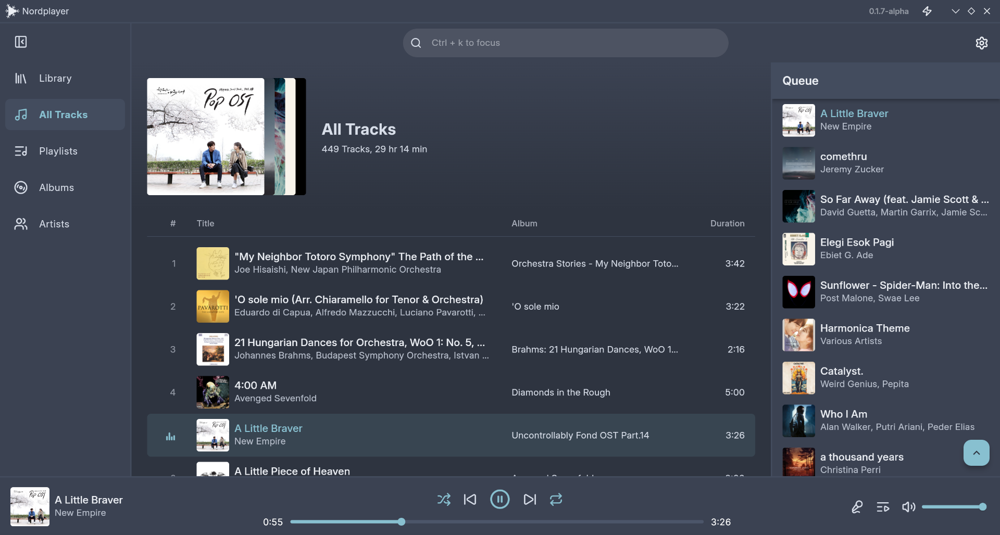
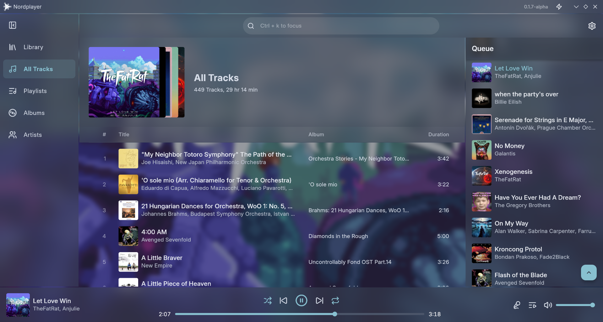
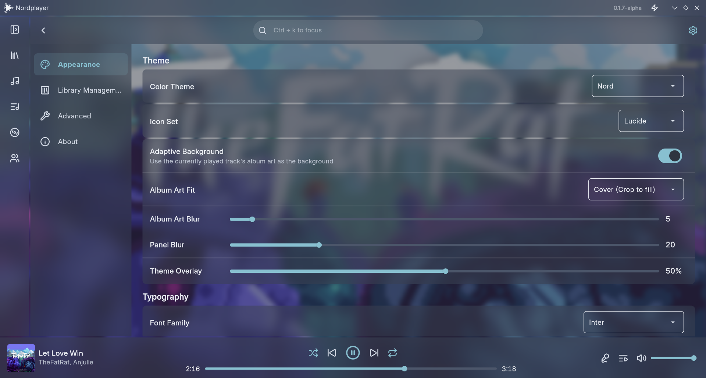

<!-- LOGO -->

  
<h2 align="center">
  Nordplayer
</h2>

  A highly customizable music player with extensive theming.

## Why?
Of all the music players I've tried (I tried a lot of them, btw), I still haven't found one that's of my preference. The closest I could get was MusicBee, but that only runs on Windows.

A lot of the other options, especially the ones that also run on linux, still have what I call "old UIs" --look at Rhythmbox, Strawberry, Elisa. While most of them are performant because they use C/C++, I just don't like it --not saying they're bad, it's just (as I said before) not my preference. I want something more modern.

And since I'm something of a programmer myself, why can't I just build one? Or try, at least. So, here we are.

## Current App State
This app is still very early in the development stage. I’m still figuring out exactly where I want to take this project.

## Screenshot

