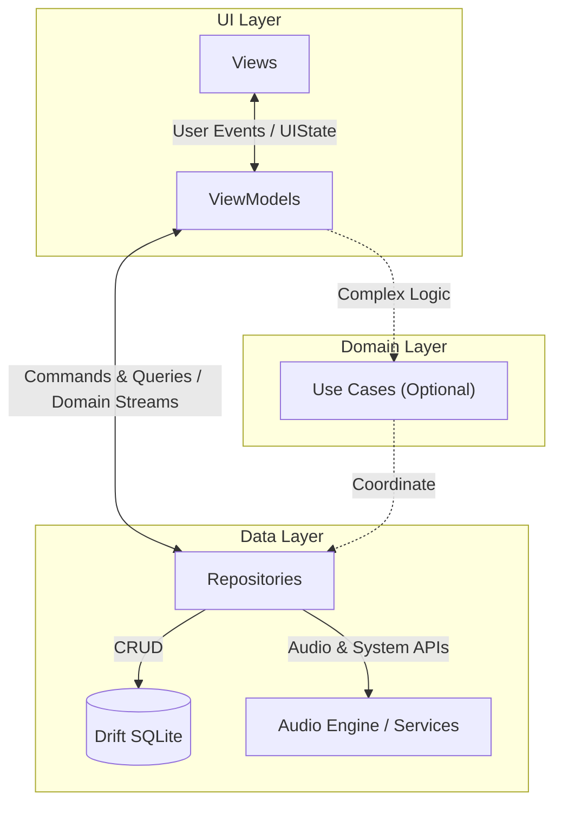

# Architecture

NordPlayer follows the [Flutter architecture guidelines](https://docs.flutter.dev/app-architecture), implementing a **Layered Architecture** (UI, Domain, Data) with **feature-sliced MVVM**.



## Core Layers

- **UI (`lib/ui/`)**: Feature-sliced presentation. Views render `UIState` and forward user actions to ViewModels (MVVM). Shared widgets, themes, and shortcuts live in `ui/shared/`.
- **Domain (`lib/domain/`)**: Pure Dart entities (`models/`) and business rules (`use_cases/`) with zero Flutter, database, or external dependencies.
- **Data (`lib/data/`)**: Single source of truth. Repositories coordinate domain data, `database/` manages Drift SQLite persistence, and `services/` drive platform APIs and background engines.

---

## Directory Layout

```
nordplayer/
├── lib/
│   ├── config/              # App configuration & config.json schema
│   ├── data/                # Persistence, repositories, and platform services
│   │   ├── database/        # Drift SQLite schema, db instance, and mappers
│   │   ├── repositories/    # Repository interfaces & implementations
│   │   └── services/        # Audio engine, indexer, storage, system services
│   ├── domain/              # Pure domain entities and use cases
│   │   ├── models/          # Pure entities (Track, Album, Playlist, etc.)
│   │   └── use_cases/       # Cross-repository interactors
│   ├── routing/             # GoRouter setup & navigation history
│   ├── ui/                  # Presentation layer
│   │   ├── <feature>/       # Views, viewmodels, UI states, child widgets
│   │   └── shared/          # Reusable widgets, themes, shortcuts
│   ├── utils/               # Extensions, logger, Result monad
│   └── main.dart            # App entry point
├── testing/fakes/           # Reusable in-memory test doubles
└── test/                    # Mirrored test suite (ui/, data/, domain/, etc.)
```

---

## Key Invariants

1. **Unidirectional Data Flow**: User actions flow down (`View` $\rightarrow$ `ViewModel` $\rightarrow$ `Repository` / `UseCase`); State flows up via immutable `UIState` and domain streams.
2. **Pure ViewModels**: Zero `BuildContext` or Flutter widget imports inside ViewModels.
3. **Pure Domain**: `lib/domain/` has zero framework, database, or Flutter dependencies — strictly pure Dart.
4. **Domain Isolation**: Drift database records never leak past `lib/data/`; repositories always return pure domain models.
5. **Single Immutable UIState**: Each view observes a single immutable state class updated via `copyWith`.
6. **Mirrored Testing**: `test/` mirrors `lib/` 1:1; reusable doubles live in `testing/fakes/`.
