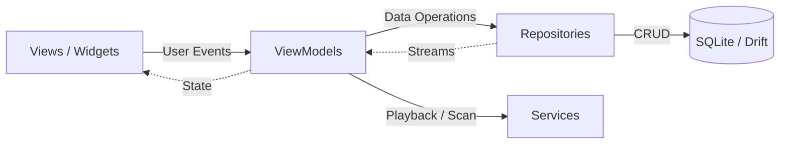

# Architecture

NordPlayer follows a **Feature-Sliced MVVM** pattern with **Domain Services**, using **Riverpod** for state management and **Drift (SQLite)** for persistence.



### Core Layers

- **View**: Flutter UI widgets. Observes state and forwards user gestures to ViewModels. Contains zero business logic and makes no direct database queries.
- **ViewModel**: Pure presentation state and user action orchestrator. UI-agnostic (no `BuildContext` or Flutter widgets). Calls Repositories and Services.
- **Repository**: Single source of truth for persistent data access. Co-locates abstract interfaces with Drift SQLite implementations in the same file.
- **Services**: Autonomous, long-running engines that execute independently of UI screen lifecycles (such as audio playback and background library indexing).
- **Core**: Shared, cross-cutting infrastructure including the local database setup, domain entities, low-level system services, design tokens, and utility helpers.
- **Routes**: Declarative routing configuration and navigation history.

---

## Folder Structure

```
lib/
├── core/                  # App-wide foundational infrastructure
│   ├── database/          # SQLite database schema, connections, and migrations
│   ├── models/            # Shared domain entities and data models
│   ├── shortcuts/         # Keyboard shortcuts and input bindings
│   ├── system/            # System-level services (config, preferences, logging, platform)
│   ├── theme/             # Design system, palettes, typography, and icon sets
│   └── utils/             # Pure helper functions and extension methods
├── data/
│   └── repositories/      # Persistent data access interfaces and SQLite implementations
├── features/              # Feature-sliced presentation layer
│   └── <feature>/         # Feature views, viewmodels, and feature-specific widgets
├── routes/                # Navigation setup, route definitions, and history tracking
├── services/              # Autonomous, long-running domain engines
│   ├── audio/             # Playback engine, audio output, and hardware media session
│   └── indexer/           # Filesystem scanning, metadata parsing, and directory watching
└── widgets/               # Reusable, application-wide UI components
```

---

## Key Invariants

1. **Unidirectional Flow**: `View` $\rightarrow$ `ViewModel` $\rightarrow$ `Repository` / `Service` $\rightarrow$ `Database`. Lower layers never import upper layers.
2. **Pure ViewModels**: Zero Flutter widgets or `BuildContext` inside ViewModels.
3. **Direct Imports**: No internal barrel files (`repositories.dart`, `services.dart`). Import concrete files directly.
